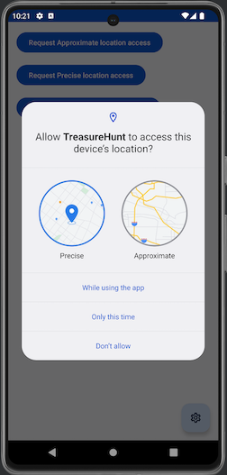
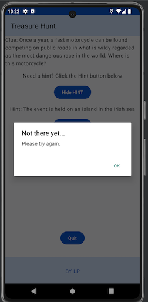
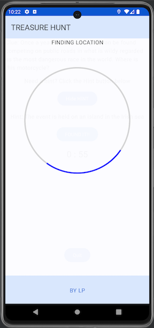

# Treasure-Hunt
Welcome to my mobile application!

## Table of Contents

- [Treasure-Hunt](#treasure-hunt)
  - [Table of Contents](#table-of-contents)
  - [Overview](#overview)
  - [App File Structure](#app-file-structure)
  - [Features](#features)
  - [Screenshots](#screenshots)
    - [Location permission Screen](#location-permission-screen)
    - [Rule Screen](#rule-screen)
    - [First Clue Screen](#first-clue-screen)
    - [Success](#success)
    - [Try Again](#try-again)
    - [Calculating location Screen](#calculating-location-screen)
    - [Final Clue complete](#final-clue-complete)
  - [Technologies Used](#technologies-used)
  - [Installation and Operation](#installation-and-operation)

## Overview

The Teasure Hunt program mimics a geochacing application allowing a user to search for a specific location given a clue and subsequent hints if desired. Once a user believes they are at location in question, they are able to confirm if they are correct or not.

## App File Structure
The following is a brief overview of the file structure

[app/src/main/java/com/example/treasurehunt](https://github.com/voyagerfan/Treasure-Hunt/tree/main/app/src/main/java)
* all screens and viewmodel
* [/data](https://github.com/voyagerfan/Treasure-Hunt/tree/main/app/src/main/java/com/example/treasurehunt/data) contains the data for the models 
* [/model](https://github.com/voyagerfan/Treasure-Hunt/tree/main/app/src/main/java/com/example/treasurehunt/model) contains the data classes

[app/src/main/res/drawable](https://github.com/voyagerfan/Treasure-Hunt/tree/main/app/src/main/res/drawable)
* images and strings

## Features

This application includes the following features: 
* A location persmission request screen for different levels of location accuracy. 
* A list of rules for the game.
* Two (2) different locations with 1 clue and 1 optional hint per location. Hints are may be toggled between hidden and exposed.
* Confirmation of a found location by clicking "Found It". 
* Congratulatory screens are presented when a location is found "retry screens" are presented when the user location is >0.25Km from the actual location (determined by the haversine formula).
* A cumulative timer is available to keep track of the total time spent searching for all locations. The timer only advances when a clue is actively being searched for. The timer is reset when the game is restarted.
* Implements MVVM architecture for scalability, separation of concerns, maintainability and reusability. 

## Screenshots
### Location permission Screen

### Rule Screen

### First Clue Screen

### Success

### Try Again

### Calculating location Screen

### Final Clue complete

## Technologies Used

- **Programming Languages:** Kotlin, XML
- **Frameworks:** Android SDK, Jetpack Compose
- **IDE:** Android Studio

## Installation and Operation
*Prerequisites:* [Android Studio](https://developer.android.com/studio)

Once you have downloaded and installed Android Studio:
* Clone the repo to your desired directory
* Open Android Studio
* Go to **File** > **Open**
* Select the project folder
* The project will open once the import is complete
* Press the Run icon in the top right corner of the IDE

